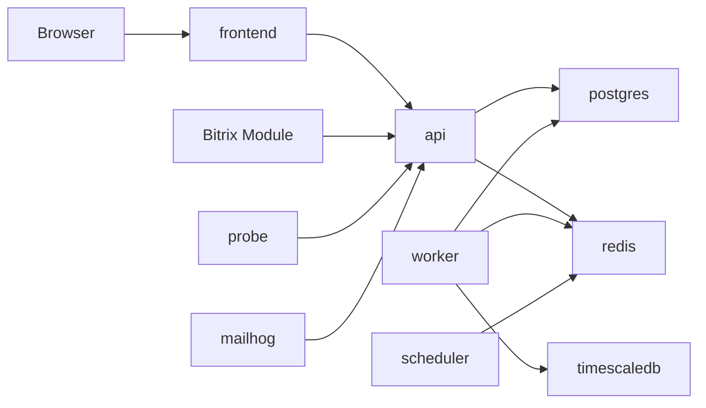

# Docker Compose

## Назначение

Docker Compose используется для:

- локальной разработки;
- демонстрационного self-hosted preview;
- интеграционных тестов MVP.

## Состав Сервисов



## Required Services

| Service | Image Source | Notes |
| --- | --- | --- |
| `api` | local build | Symfony backend |
| `frontend` | local build | React cabinet |
| `worker` | same as api | Symfony Messenger workers |
| `scheduler` | same as api | Probe scheduling commands |
| `probe` | local build | Stateless probe node |
| `postgres` | postgres:16 | Business DB |
| `timescaledb` | timescale/timescaledb | Metrics/probe results |
| `redis` | redis:7 | Queue and locks |
| `nginx` | nginx | Reverse proxy for self-hosted preview |
| `mailhog` | mailhog/mailhog | Local email |

## Volumes

- `postgres_data`.
- `timescale_data`.
- `redis_data` optional.
- `object_storage_data` when MinIO is added.

## Self-hosted Preview Constraints

MVP self-hosted preview includes:

- single-node Docker Compose;
- seed admin user;
- local probe node;
- disabled real billing;
- email via configured SMTP;
- manual backup/restore instructions.

Not included:

- Kubernetes;
- high availability;
- enterprise SSO;
- multi-node probe management;
- automatic upgrades.

## Environment Files

Use separate files:

- `.env.local` for developer machines;
- `.env.self-hosted.example` for clients;
- `.env.test` for integration tests;
- `deploy/.env.production.example` for Coolify/production.

Production deployment guide: [coolify.md](./coolify.md).

## Release Images

Every public build should publish versioned images:

```text
monitoring-api:0.1.0
monitoring-frontend:0.1.0
monitoring-probe:0.1.0
```

Use immutable tags for releases and avoid deploying `latest` in self-hosted documentation.
