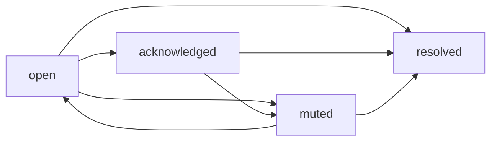

# Incident Lifecycle

## Statuses

| Status | Meaning |
| --- | --- |
| `open` | Problem is active and not acknowledged |
| `acknowledged` | Operator accepted the incident |
| `resolved` | Problem is fixed |
| `muted` | Notifications are suppressed until a configured time |

## Lifecycle

## Incident Events

Events:

- `opened`;
- `evidence_updated`;
- `acknowledged`;
- `comment_added`;
- `muted`;
- `notification_sent`;
- `notification_failed`;
- `resolved`.

## Evidence

Incident card must show:

- affected check;
- current value and threshold;
- first evidence;
- latest evidence;
- timeline of events;
- notification delivery history.

## Manual Actions

Allowed actions:

- acknowledge;
- add comment;
- mute;
- close manually;
- reopen if problem is detected again.

Manual close should create event and should not delete evidence.
