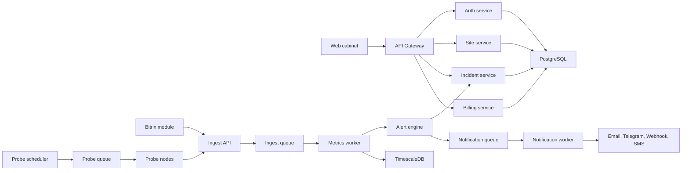

# System Design: SaaS/backend мониторинга Bitrix

## 1. Назначение документа

Документ описывает серверную часть сервиса мониторинга: API, БД, очереди, внешние probe-ноды, alert engine, уведомления, биллинг, self-hosted поставку и требования к безопасности.

## 2. Архитектурные принципы

- Ingest API должен быстро принимать данные и передавать тяжёлую обработку в очередь.
- Внешний uptime не должен зависеть от работоспособности Bitrix-модуля.
- Все события должны быть идемпотентными.
- Alert engine не должен создавать дубликаты одного и того же инцидента.
- Tenant-изоляция обязательна на уровне всех запросов, фоновых задач и отчётов.
- Сервис должен одинаково работать в SaaS и self-hosted поставке.

## 3. Рекомендуемый стек

MVP:

- Backend: PHP 8.2+ на Symfony/Laravel или Go. Если команда сильнее в PHP, предпочтителен Symfony.
- Frontend: React/Vue SPA.
- PostgreSQL: бизнес-данные.
- TimescaleDB: time-series метрики, если хочется остаться в PostgreSQL-экосистеме.
- Redis: очереди, locks, rate limits, cache.
- Object Storage: отчёты, экспорты, вложения диагностики.
- Docker Compose: dev и self-hosted MVP.

Production-расширение:

- ClickHouse для больших объёмов метрик.
- RabbitMQ/Kafka для высоконагруженного ingest.
- Kubernetes для SaaS и enterprise.
- Prometheus/Grafana для мониторинга самого сервиса.

## 4. Компоненты backend



### API Gateway

Отвечает за:

- маршрутизацию REST API кабинета;
- JWT/session auth для пользователей;
- RBAC;
- rate limiting;
- request id / correlation id;
- audit log для чувствительных действий.

### Ingest API

Отвечает за:

- приём heartbeat, metrics batch, events batch;
- проверку HMAC-подписи;
- защиту от replay;
- первичную валидацию payload;
- постановку данных в очередь;
- быстрый ответ модулю.

### Site Service

Отвечает за:

- сайты;
- проекты;
- клиентов интегратора;
- ключи подключения;
- ротацию секретов;
- лимиты тарифа;
- remote config для модулей.

### Alert Engine

Отвечает за:

- применение правил;
- debounce;
- дедупликацию инцидентов;
- открытие, обновление и закрытие инцидентов;
- maintenance windows;
- mute;
- repeat notifications;
- эскалации на расширенном этапе.

### Notification Service

Отвечает за:

- email;
- Telegram;
- webhook;
- SMS/voice на расширенном этапе;
- retry;
- rate limits;
- историю доставок.

### Probe Service

Отвечает за:

- планирование внешних проверок;
- HTTP/HTTPS checks;
- SSL checks;
- DNS checks;
- отправку результатов в ingest;
- независимую работу probe-нод.

## 5. Основные потоки данных

### Heartbeat от модуля

1. Модуль формирует payload с `site_id`, timestamp, module version, environment summary.
2. Подписывает body HMAC-SHA256.
3. Отправляет `POST /api/v1/heartbeat`.
4. Ingest API проверяет подпись и timestamp.
5. Событие кладётся в `ingest_queue`.
6. Worker обновляет `sites.last_heartbeat_at`.
7. Alert engine закрывает инцидент `heartbeat_missing`, если связь восстановилась.

### Batch метрик

1. Модуль собирает метрики.
2. Сохраняет payload в локальную очередь.
3. Отправляет batch.
4. API отвечает `202 Accepted`.
5. Worker нормализует метрики.
6. Time-series данные записываются в TimescaleDB.
7. Alert engine применяет правила.
8. При нарушении создаётся или обновляется инцидент.

### Внешняя проверка uptime

1. Scheduler создаёт задачу проверки.
2. Несколько probe-нод выполняют HTTP request.
3. Результаты отправляются в ingest.
4. Alert engine ждёт подтверждения проблемы по правилу.
5. Если условие выполнено, открывается инцидент.

## 6. API контракты MVP

### Module handshake

`POST /api/v1/sites/handshake`

Headers:

- `X-Site-Id`
- `X-Timestamp`
- `X-Signature`
- `X-Module-Version`

Request:

```json
{
  "domain": "example.ru",
  "siteUrl": "https://example.ru",
  "bitrixVersion": "25.0.0",
  "phpVersion": "8.2.12",
  "encoding": "UTF-8",
  "mode": "saas"
}
```

Response:

```json
{
  "status": "ok",
  "siteId": "site_123",
  "serverTime": "2026-06-02T11:00:00Z",
  "configVersion": 4
}
```

### Heartbeat

`POST /api/v1/heartbeat`

Request:

```json
{
  "eventId": "uuid",
  "collectedAt": "2026-06-02T11:00:00Z",
  "module": {
    "version": "1.0.0",
    "collectorInterval": 300
  },
  "environment": {
    "bitrixVersion": "25.0.0",
    "phpVersion": "8.2.12"
  }
}
```

### Metrics batch

`POST /api/v1/metrics/batch`

Request:

```json
{
  "batchId": "uuid",
  "collectedAt": "2026-06-02T11:00:00Z",
  "metrics": [
    {
      "key": "disk.free_percent",
      "value": 24.5,
      "unit": "percent",
      "severityHint": "ok",
      "tags": {
        "path": "document_root"
      }
    }
  ]
}
```

### Events batch

`POST /api/v1/events/batch`

Request:

```json
{
  "batchId": "uuid",
  "events": [
    {
      "eventId": "uuid",
      "type": "backup.last_success",
      "occurredAt": "2026-06-02T11:00:00Z",
      "payload": {
        "lastBackupAt": "2026-06-01T03:00:00Z"
      }
    }
  ]
}
```

### Remote config

`GET /api/v1/module/config`

Response:

```json
{
  "configVersion": 4,
  "collectorInterval": 300,
  "enabledCollectors": [
    "environment",
    "disk",
    "backup",
    "modules",
    "agents"
  ],
  "limits": {
    "maxDirectoryScanDepth": 3,
    "maxPayloadBytes": 262144
  }
}
```

## 7. Схема БД MVP

### `organizations`

- `id`
- `name`
- `plan_code`
- `created_at`
- `updated_at`

### `users`

- `id`
- `email`
- `password_hash`
- `name`
- `status`
- `created_at`
- `updated_at`

### `organization_users`

- `organization_id`
- `user_id`
- `role`

### `projects`

- `id`
- `organization_id`
- `client_name`
- `name`
- `created_at`

### `sites`

- `id`
- `organization_id`
- `project_id`
- `domain`
- `site_url`
- `status`
- `module_version`
- `bitrix_version`
- `php_version`
- `last_heartbeat_at`
- `config_version`
- `created_at`
- `updated_at`

### `site_keys`

- `id`
- `site_id`
- `key_id`
- `secret_hash`
- `active_from`
- `active_to`
- `revoked_at`

Секрет хранить только в виде хеша/зашифрованного значения, пригодного для проверки HMAC выбранным способом. Полный секрет показывать пользователю только при создании.

### `checks`

- `id`
- `site_id`
- `type`
- `enabled`
- `interval_seconds`
- `settings_json`
- `created_at`
- `updated_at`

### `alert_rules`

- `id`
- `organization_id`
- `site_id`
- `check_type`
- `severity`
- `condition_json`
- `debounce_seconds`
- `repeat_seconds`
- `enabled`

### `incidents`

- `id`
- `organization_id`
- `site_id`
- `check_type`
- `fingerprint`
- `severity`
- `status`
- `title`
- `opened_at`
- `acknowledged_at`
- `resolved_at`
- `muted_until`
- `last_evidence_json`

Уникальный индекс для активных инцидентов: `site_id + check_type + fingerprint + status in open/acknowledged`.

### `incident_events`

- `id`
- `incident_id`
- `type`
- `message`
- `payload_json`
- `created_by`
- `created_at`

### `notification_channels`

- `id`
- `organization_id`
- `type`
- `name`
- `settings_encrypted`
- `enabled`
- `created_at`

### `notification_deliveries`

- `id`
- `incident_id`
- `channel_id`
- `status`
- `attempt`
- `error`
- `sent_at`
- `created_at`

### Time-series таблица `metrics`

- `time`
- `organization_id`
- `site_id`
- `key`
- `value_float`
- `value_string`
- `unit`
- `tags_json`
- `event_id`

### Time-series таблица `probe_results`

- `time`
- `site_id`
- `check_id`
- `probe_id`
- `status`
- `http_code`
- `response_time_ms`
- `error_code`
- `error_message`
- `evidence_json`

## 8. Alert engine

### Типы правил MVP

- `threshold`: значение меньше/больше порога.
- `expiry`: дата наступит раньше N дней.
- `missing`: нет heartbeat или данных дольше N минут.
- `probe_failure`: ошибка подтверждена несколькими проверками.
- `state`: состояние равно одному из запрещённых значений.

### Дедупликация

Для каждого нарушения рассчитывается fingerprint:

```text
site_id + check_type + normalized_problem_key
```

Примеры:

- `site_1:ssl_expiry:example.ru`
- `site_1:disk_low:document_root`
- `site_1:agent_stuck:agent_id_15`

Если активный инцидент с fingerprint уже есть, создаётся `incident_event`, а не новый инцидент.

### Debounce

Для critical uptime:

- открыть инцидент только после 2 последовательных ошибок или ошибок с 2 probe-нод;
- закрыть только после 2 успешных проверок подряд.

Для warning:

- можно создавать сразу, если риск регламентный: SSL менее 14 дней, диск менее 15%.

### Maintenance window

Если сайт или проверка находится в maintenance:

- инциденты не создаются;
- результаты проверок сохраняются;
- при выходе из окна правило оценивается заново.

## 9. Probe-ноды

### Требования

- Probe-нода должна быть stateless.
- Получает задания из API/очереди.
- Выполняет проверки с таймаутами.
- Не хранит секреты сайтов.
- Отправляет результаты в ingest API.
- Имеет собственный health endpoint.

### HTTP check

Настройки:

- URL;
- method `GET`/`HEAD`;
- timeout;
- follow redirects;
- allowed status codes;
- expected text;
- headers;
- user agent.

Защита от SSRF:

- запрет приватных IP;
- запрет link-local;
- запрет localhost;
- разрешённые схемы только `http` и `https`;
- ограничение портов;
- повторная проверка IP после DNS resolve.

### SSL check

Проверяет:

- срок действия;
- CN/SAN;
- цепочку;
- ошибку handshake;
- протокол.

### DNS check

MVP:

- resolve A/AAAA;
- ошибка NXDOMAIN/SERVFAIL;
- изменение NS как info/warning.

## 10. Notification service

### Каналы MVP

Email:

- SMTP или transactional provider;
- HTML и text шаблоны;
- DKIM/SPF на домене сервиса.

Telegram:

- bot token;
- chat id;
- тест отправки;
- обработка ошибок blocked/migrated chat.

Webhook:

- POST JSON;
- HMAC-подпись исходящего webhook;
- retry на 5xx;
- не ретраить 4xx, кроме 429.

### Retry policy

- 1-я попытка сразу.
- 2-я через 1 минуту.
- 3-я через 5 минут.
- 4-я через 15 минут.
- Затем delivery failed.

### Rate limits

- Глобальный лимит на аккаунт.
- Лимит на канал.
- Группировка однотипных warning-событий.

## 11. Биллинг и лимиты

Backend должен уметь проверять лимиты:

- количество сайтов;
- частота uptime-проверок;
- число пользователей;
- срок хранения истории;
- доступность проектов/клиентов;
- доступность отчётов;
- доступность webhook;
- доступность SMS/voice.

MVP может работать без реального платёжного провайдера, но доменная модель тарифов должна быть заложена сразу.

## 12. Self-hosted backend

Docker Compose состав:

- `api`;
- `frontend`;
- `worker`;
- `scheduler`;
- `probe`;
- `postgres`;
- `redis`;
- `timescaledb` или отдельная БД;
- `nginx`;
- optional `mailhog` для dev.

Self-hosted требования:

- переменные окружения для всех секретов;
- первичная миграция БД;
- seed admin user;
- health endpoint;
- backup/restore инструкция;
- обновления через versioned images;
- отключаемый billing.

## 13. Безопасность backend

Обязательные меры:

- TLS для всех публичных endpoint-ов.
- HMAC для module-to-api.
- JWT/session auth для кабинета.
- Refresh token rotation.
- RBAC.
- Tenant scope в каждом запросе.
- Rate limit для auth и ingest.
- Audit log для изменения ключей, пользователей, каналов уведомлений.
- Шифрование настроек notification channels.
- Маскирование секретов в логах.
- Запрет хранения raw request body с секретами.
- Валидация JSON schema для ingest payload.
- Защита webhook URL от SSRF.

## 14. Observability самого сервиса

Метрики:

- ingest requests/sec;
- ingest latency;
- rejected signatures;
- queue size;
- worker failures;
- notification delivery success rate;
- probe success/failure by region;
- opened/resolved incidents;
- API error rate;
- DB latency.

Логи:

- structured JSON;
- correlation id;
- organization id и site id, где безопасно;
- без секретов и персональных данных.

Алерты внутренней платформы:

- ingest API недоступен;
- очередь растёт;
- probe-нода не присылает результаты;
- notification error rate выше порога;
- DB недоступна.

## 15. Критерии готовности backend MVP

Backend MVP готов, если:

- API принимает подписанные heartbeat и metrics batch.
- Неподписанные и просроченные запросы отклоняются.
- Сайты, пользователи и организации хранятся в БД.
- Метрики пишутся в time-series хранилище.
- Внешние probe-ноды выполняют HTTP и SSL проверки.
- Alert engine создаёт, обновляет и закрывает инциденты.
- Telegram, email и webhook уведомления отправляются через очередь.
- Кабинет получает данные по сайтам, метрикам и инцидентам.
- Тарифные лимиты применяются хотя бы на уровне количества сайтов и частоты проверок.
- Есть health checks и базовые метрики самого сервиса.
